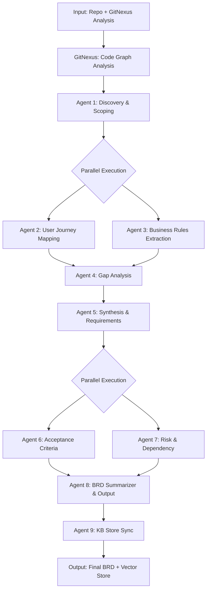

# BRD Agents Orchestration

## Overview
This document describes the orchestration logic for the BRD Agentic Framework's multi-agent pipeline.

## Pipeline Flow



## Agent Roles

### Agent 1: Discovery & Scoping
- **Input**: Repository path, GitNexus graph data
- **Output**: scope_definition.json, artifact_catalog.json, dependency_map.json
- **Role**: Scans repository, locates artifacts, defines scope boundaries

### Agent 2: User Journey Mapping
- **Input**: Agent 1 outputs, code structure
- **Output**: user_journeys.json, touchpoints.json, actors.json
- **Role**: Maps user and system journeys from code and tests

### Agent 3: Business Rules Extraction
- **Input**: Agent 1 & 2 outputs, code patterns
- **Output**: business_rules.json, validation_logic.json
- **Role**: Extracts business rules from code and configurations

### Agent 4: Gap Analysis
- **Input**: Agent 1, 2, 3 outputs, kb_store historical data
- **Output**: gap_analysis.json, recommendations.json
- **Role**: Identifies gaps between current state and requirements

### Agent 5: Synthesis & Requirements
- **Input**: Agent 1-4 outputs
- **Output**: functional_requirements.json, non_functional_requirements.json
- **Role**: Synthesizes findings into structured requirements

### Agent 6: Acceptance Criteria
- **Input**: Agent 5 requirements
- **Output**: acceptance_criteria.json, test_scenarios.json
- **Role**: Generates testable acceptance criteria (Given-When-Then)

### Agent 7: Risk & Dependency Analysis
- **Input**: Agent 1, 4, 5, 6 outputs
- **Output**: risk_assessment.json, dependency_analysis.json
- **Role**: Identifies risks and maps dependencies

### Agent 8: BRD Summarizer & Output
- **Input**: All Agent 1-7 outputs
- **Output**: final_brd.md, executive_summary.json
- **Role**: Consolidates all outputs into final BRD document

### Agent 9: KB Store Sync
- **Input**: KB/{repo_name}/ JSON artifacts
- **Output**: Vector embeddings in kb_store/, ingestion_log.json
- **Role**: Ingests artifacts into searchable vector database

## Agent Dependencies

### Sequential Dependencies
1. **Agent 1** must complete before **Agents 2 & 3**
2. **Agents 2 & 3** must complete before **Agent 4**
3. **Agent 4** must complete before **Agent 5**
4. **Agent 5** must complete before **Agents 6 & 7**
5. **Agents 6 & 7** must complete before **Agent 8**
6. **Agent 8** must complete before **Agent 9**

### Parallel Execution Groups
- **Group 1**: Agents 2 & 3 (after Agent 1)
- **Group 2**: Agents 6 & 7 (after Agent 5)

## State Management

### State Contract
Each agent reads from and writes to a shared state object managed by LangGraph.

#### Agent 1 Output
```json
{
  "scope_definition": {
    "component_name": "JPetStore",
    "domain": "e-commerce",
    "in_scope": ["pet catalog", "shopping cart", "order processing"],
    "out_of_scope": ["payment gateway", "shipping integration"],
    "assumptions": ["MySQL database", "Java 11+"]
  },
  "artifact_catalog": {
    "artifacts": [
      {"type": "build_file", "path": "pom.xml", "relevance": 0.95},
      {"type": "config", "path": "application.properties", "relevance": 0.88}
    ]
  },
  "dependency_map": {
    "upstream": ["authentication-service"],
    "downstream": ["inventory-service"],
    "external": ["MySQL", "Spring Framework"]
  },
  "overall_confidence": 0.87
}
```

#### Agent 2 Output
```json
{
  "user_journeys": [
    {
      "id": "UJ001",
      "name": "Browse and Purchase Pet",
      "steps": ["view catalog", "select pet", "add to cart", "checkout"],
      "touchpoints": ["PetController", "CartService", "OrderController"]
    }
  ],
  "actors": [
    {"id": "customer", "type": "user", "permissions": ["browse", "purchase"]},
    {"id": "admin", "type": "user", "permissions": ["manage_catalog", "view_orders"]}
  ],
  "confidence": 0.85
}
```

#### Agent 3 Output
```json
{
  "business_rules": [
    {
      "id": "BR001",
      "category": "validation",
      "description": "Pet price must be positive decimal",
      "source_location": "Pet.java:45",
      "confidence": 0.92
    }
  ],
  "validation_logic": {
    "email_format": "^[a-zA-Z0-9._%+-]+@[a-zA-Z0-9.-]+\\.[a-zA-Z]{2,}$",
    "phone_format": "^\\d{10}$"
  },
  "confidence": 0.88
}
```

#### Agent 4 Output
```json
{
  "gap_analysis": [
    {
      "id": "GAP001",
      "type": "missing_validation",
      "severity": "high",
      "description": "No email format validation in registration",
      "recommendation": "Add @Email annotation",
      "confidence": 0.90
    }
  ],
  "recommendations": [
    {"gap_id": "GAP001", "priority": 1, "effort": "low", "action": "Add validation"}
  ],
  "confidence": 0.82
}
```

#### Agent 5 Output
```json
{
  "functional_requirements": [
    {
      "id": "FR001",
      "category": "user_interface",
      "title": "Email validation on registration",
      "description": "System shall validate email format during user registration",
      "priority": "must_have",
      "complexity": "low",
      "confidence": 0.92
    }
  ],
  "non_functional_requirements": [
    {
      "id": "NFR001",
      "category": "performance",
      "title": "API response time under 2 seconds",
      "measurable_criterion": "p90 response time <= 2000ms",
      "priority": "must_have"
    }
  ],
  "total_requirements": 45,
  "must_have": 20,
  "should_have": 15,
  "could_have": 10
}
```

#### Agent 6 Output
```json
{
  "acceptance_criteria": [
    {
      "id": "AC001",
      "requirement_id": "FR001",
      "given": "User is on registration page",
      "when": "User enters valid email 'user@example.com'",
      "then": "Email is accepted and validation passes",
      "test_type": "functional",
      "priority": "high",
      "automation_feasible": true
    }
  ],
  "test_scenarios": [
    {
      "id": "TS001",
      "title": "User Registration Happy Path",
      "acceptance_criteria_ids": ["AC001", "AC002"],
      "steps": [
        {"step": 1, "action": "Navigate to registration", "expected": "Form displayed"},
        {"step": 2, "action": "Enter valid email", "expected": "Validation passes"}
      ]
    }
  ],
  "total_criteria": 127
}
```

#### Agent 7 Output
```json
{
  "risk_assessment": [
    {
      "id": "RISK001",
      "category": "security",
      "severity": "high",
      "probability": "likely",
      "title": "SQL injection vulnerability",
      "mitigation_strategy": {
        "approach": "Use parameterized queries",
        "effort": "medium",
        "residual_risk": "low"
      }
    }
  ],
  "dependency_analysis": {
    "requirement_dependencies": [
      {"requirement_id": "FR023", "depends_on": ["FR001", "FR015"]}
    ],
    "system_dependencies": [
      {"component": "PaymentService", "type": "external_api", "criticality": "critical"}
    ]
  },
  "total_risks": 23,
  "critical": 2,
  "high": 7
}
```

#### Agent 8 Output
```json
{
  "executive_summary": {
    "project_name": "JPetStore Modernization",
    "analysis_date": "2026-08-12",
    "key_metrics": {
      "total_requirements": 45,
      "critical_risks": 2,
      "gaps_identified": 12
    },
    "critical_findings": [
      "Payment gateway dependency creates critical risk",
      "12 validation gaps require immediate attention"
    ],
    "overall_confidence": 0.87
  },
  "final_brd_path": "KB/jpetstore-6/final_brd.md"
}
```

#### Agent 9 Output
```json
{
  "ingestion_status": "success",
  "source_directory": "KB/jpetstore-6/",
  "documents_ingested": 8,
  "embeddings_generated": 243,
  "collection_name": "brd_artifacts",
  "vector_store_path": "kb_store/chromadb/",
  "artifacts_processed": [
    {"file": "scope_definition.json", "chunks": 12, "status": "success"},
    {"file": "functional_requirements.json", "chunks": 87, "status": "success"}
  ]
}
```

## HITL (Human-in-the-Loop) Handling

### HITL Modes
- **CLI**: Display prompt in terminal and wait for input
- **File**: Write decision package to file and continue
- **Both**: Display in terminal AND write to file

### HITL Flow
1. Agent detects trigger condition
2. HITL handler formats decision package
3. Handler routes to appropriate mode
4. If CLI: wait for user input
5. If File: write to `HITL_PENDING/` and continue
6. Agent ingests response and continues

### HITL Triggers by Agent
See individual agent `.agent.md` files for specific triggers.

## Error Handling

### Graceful Degradation
- If tool is disabled, stub adapter returns empty result
- If confidence below threshold, flag but continue
- If non-blocking gap found, document and proceed
- If blocking issue found, trigger appropriate HITL

### Recovery Strategies
1. **Low Confidence**: Flag in output, reduce overall confidence score
2. **Missing Data**: Document gap, proceed with available data
3. **Conflict**: Attempt autonomous resolution, escalate if needed
4. **Blocking Gap**: Trigger HITL, wait for resolution

## Configuration

All orchestration behavior is controlled via `config.yaml`:
- Agent enable/disable
- Sub-agent enable/disable
- Tool selection and adapter mapping
- HITL mode and triggers
- Confidence thresholds
- Output paths

## Execution

### PowerShell (Recommended)
Run the complete pipeline with GitNexus integration:
```powershell
.\run_brd_pipeline.ps1 -RepoPath ".\jpetstore-6" -UseGitNexus -Verbose
```

Run without GitNexus:
```powershell
.\run_brd_pipeline.ps1 -RepoPath ".\jpetstore-6"
```

### Individual Agent Execution
Run a specific agent:
```powershell
.\.github\skills\agent-1-discovery\agent_1_discovery.ps1 -RepoPath ".\jpetstore-6" -Verbose
```

### Python (Alternative)
```bash
python .github/skills/agent-1-discovery/agent_1_discovery_enhanced.py --repo ./jpetstore-6 --config config/config.yaml
```

## GitNexus Integration

### Step 0: GitNexus Analysis
Before running agents, GitNexus analyzes the repository to create a code graph:
```powershell
cd jpetstore-6
npx gitnexus analyze
```

**Output:**
- Code graph with nodes (code elements) and edges (relationships)
- Cluster analysis (code groupings)
- Flow analysis (execution paths)
- Stored in `.ladybug/` directory

### Agent 1 Integration
Agent 1 leverages GitNexus data for:
- Enhanced dependency mapping
- Architecture understanding
- Component identification
- Code flow analysis

## Monitoring

- LangSmith tracing enabled by default
- Event log stored in SQLite: `KB/event_log.db`
- Per-agent timing and confidence metrics logged
- HITL interactions logged to event log

## Output Structure

### KB Directory (Agent Artifacts)
```
KB/{repo_name}/
├── scope_definition.json           # Agent 1
├── artifact_catalog.json           # Agent 1
├── dependency_map.json             # Agent 1
├── user_journeys.json              # Agent 2
├── touchpoints.json                # Agent 2
├── actors.json                     # Agent 2
├── business_rules.json             # Agent 3
├── validation_logic.json           # Agent 3
├── gap_analysis.json               # Agent 4
├── recommendations.json            # Agent 4
├── functional_requirements.json   # Agent 5
├── non_functional_requirements.json # Agent 5
├── acceptance_criteria.json       # Agent 6
├── test_scenarios.json            # Agent 6
├── risk_assessment.json           # Agent 7
├── dependency_analysis.json       # Agent 7
├── final_brd.md                   # Agent 8
├── executive_summary.json         # Agent 8
└── ingestion_log.json             # Agent 9
```

### kb_store Directory (Vector Database)
```
kb_store/
├── chromadb/                       # Agent 9: Vector database
│   ├── chroma.sqlite3
│   └── [embedding data]
├── indices/                        # Search indices
└── metadata/                       # Store metadata
```

### Key Distinction
| Directory | Purpose | Format | Populated By |
|-----------|---------|--------|--------------|
| **KB/{repo_name}/** | Raw agent outputs | JSON files | Agents 1-8 |
| **kb_store/** | Searchable vector store | Embeddings | Agent 9 |

**Workflow:** Agents 1-8 write JSON to `KB/{repo_name}/` → Agent 9 reads and ingests into `kb_store/` for semantic search
