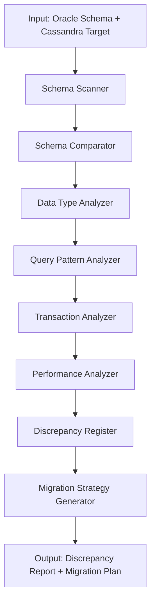

# Oracle-Cassandra Discrepancy Orchestration

## Purpose
Specialized orchestration for detecting and analyzing discrepancies between Oracle and Cassandra database implementations during migration analysis.

## Use Case
When analyzing legacy applications that are migrating from Oracle to Cassandra, this orchestration focuses on:
- Schema mapping differences
- Query pattern incompatibilities
- Transaction handling changes
- Data type mismatches
- Performance characteristic differences

## Orchestration Flow



## Analysis Dimensions

### 1. Schema Mapping
- Table to Keyspace/Table mapping
- Column to Column mapping
- Primary key differences
- Index mapping

### 2. Data Type Mapping
- Oracle types to Cassandra CQL types
- Precision and scale differences
- Custom type handling

### 3. Query Pattern Analysis
- JOIN operations (not supported in Cassandra)
- Subquery patterns
- Aggregation differences
- Window function alternatives

### 4. Transaction Handling
- ACID vs BASE model differences
- Lightweight transaction usage
- Batch operation patterns

### 5. Performance Characteristics
- Read/write patterns
- Consistency level impact
- Replication strategy
- Partition key design impact

## Output Format

```json
{
  "discrepancies": [
    {
      "type": "schema|query|transaction|performance",
      "severity": "critical|high|medium|low",
      "oracle_pattern": "...",
      "cassandra_equivalent": "...",
      "migration_strategy": "...",
      "effort_estimate": "hours",
      "risk_level": "0.0-1.0"
    }
  ],
  "summary": {
    "total_discrepancies": 0,
    "critical_count": 0,
    "migration_complexity": "low|medium|high",
    "estimated_effort_hours": 0
  }
}
```

## Integration with Main Pipeline
This orchestration can be triggered as a specialized analysis within Agent 4 (Gap Analysis) when database migration is detected.

## Configuration
Add to `config.yaml`:
```yaml
specialized_orchestrations:
  oracle_cassandra_discrepancy:
    enabled: true
    trigger: "auto"  # auto = detect Oracle usage, manual = explicit trigger
    tools:
      schema_analyzer: tree_sitter_adapter
      query_analyzer: semgrep_adapter
```
