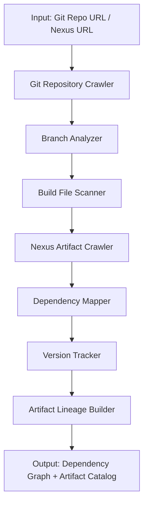

# Repo Crawler Git/Nexus Orchestration

## Purpose
Specialized orchestration for crawling Git repositories and Nexus artifact repositories to discover dependencies and build artifacts.

## Use Case
When analyzing enterprise applications, this orchestration helps:
- Discover all related repositories in Git
- Find artifact dependencies in Nexus
- Map build artifacts to source repositories
- Identify version dependencies
- Track artifact lineage

## Orchestration Flow



## Discovery Capabilities

### Git Repository Analysis
- Repository structure scanning
- Branch and tag analysis
- Commit history mining
- Contributor identification
- Build file discovery (pom.xml, build.gradle, package.json)

### Nexus Repository Analysis
- Artifact discovery
- Version history
- Dependency resolution
- SNAPSHOT vs RELEASE tracking
- Group/artifact/version (GAV) mapping

### Dependency Mapping
- Direct dependencies
- Transitive dependencies
- Dependency conflicts
- Version ranges
- Exclusions

## Output Format

```json
{
  "repositories": [
    {
      "url": "git@github.com:org/repo.git",
      "branches": ["main", "develop"],
      "build_system": "maven|gradle|npm",
      "artifacts_produced": ["group:artifact:version"]
    }
  ],
  "artifacts": [
    {
      "gav": "com.example:app:1.0.0",
      "repository": "nexus-releases",
      "source_repo": "git@github.com:org/repo.git",
      "dependencies": ["group:artifact:version"],
      "build_timestamp": "ISO8601"
    }
  ],
  "dependency_graph": {
    "nodes": [...],
    "edges": [...]
  }
}
```

## Tools Used
- `GitPython` for Git repository operations
- `requests` for Nexus REST API calls
- `tree_sitter` for build file parsing
- `networkx` for dependency graph construction

## Configuration
Add to `config.yaml`:
```yaml
specialized_orchestrations:
  repo_crawler_git_nexus:
    enabled: true
    git:
      org_url: ""  # e.g., https://github.com/myorg
      include_private: true
      max_depth: 3  # how many levels of submodule dependencies
    nexus:
      base_url: ""  # e.g., https://nexus.company.com
      repositories: ["releases", "snapshots"]
      auth_required: true
    output:
      format: "json"
      include_graph_visualization: true
```

## Integration with Main Pipeline
This orchestration can be triggered:
1. As part of Agent 1 (Discovery) for comprehensive artifact discovery
2. As a standalone analysis for dependency auditing
3. Before migration planning to understand the full artifact ecosystem

## Use Cases
- **Pre-Migration Discovery**: Understand all dependencies before planning migration
- **Artifact Audit**: Identify all artifacts and their relationships
- **Build Reconstruction**: Map source code to built artifacts
- **Dependency Resolution**: Resolve complex dependency conflicts
- **Version Planning**: Plan coordinated version upgrades
