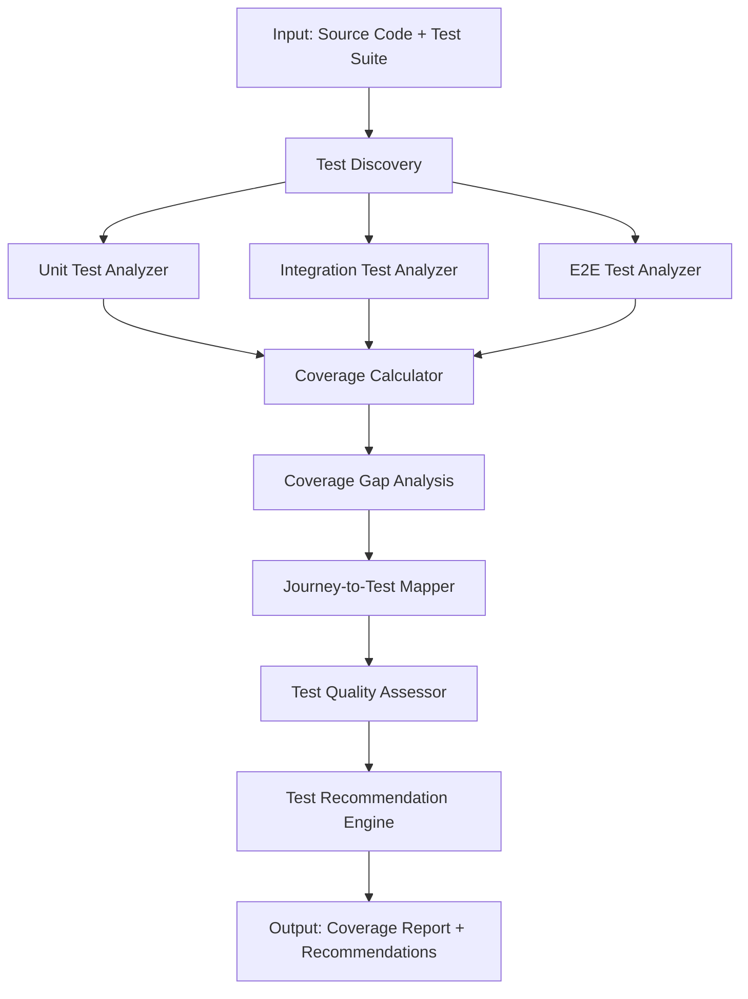

# Test Coverage Orchestration

## Purpose
Specialized orchestration for analyzing test coverage across unit, integration, and end-to-end tests.

## Use Case
When analyzing application quality and test effectiveness, this orchestration provides:
- Test coverage metrics
- Coverage gap identification
- Test quality assessment
- Journey-to-test mapping
- Test recommendation generation

## Orchestration Flow



## Analysis Dimensions

### 1. Test Discovery
- Identify all test files and frameworks
- Categorize tests by type (unit/integration/e2e)
- Extract test metadata (annotations, tags, descriptions)

### 2. Coverage Analysis
- **Line Coverage**: % of code lines executed by tests
- **Branch Coverage**: % of conditional branches tested
- **Method Coverage**: % of methods tested
- **Class Coverage**: % of classes with tests
- **Journey Coverage**: % of user journeys with tests

### 3. Gap Identification
- Uncovered code paths
- Missing error handling tests
- Untested business rules
- Journeys without automated tests
- Critical paths without coverage

### 4. Test Quality Assessment
- Test assertion strength
- Test independence (no dependencies between tests)
- Test maintainability (clarity, size, complexity)
- Test flakiness detection
- Duplicate test detection

### 5. Recommendation Generation
- Priority test suggestions
- Coverage improvement strategies
- Refactoring recommendations
- Test framework suggestions

## Test Framework Support

### Java
- JUnit 4/5
- TestNG
- Selenium WebDriver
- Cucumber/Gherkin
- Spring Test
- Mockito

### JavaScript/TypeScript
- Jest
- Mocha/Chai
- Jasmine
- Playwright
- Cypress

### Python
- pytest
- unittest
- Selenium Python
- Behave (Gherkin)

## Output Format

```json
{
  "summary": {
    "total_tests": 0,
    "unit_tests": 0,
    "integration_tests": 0,
    "e2e_tests": 0,
    "line_coverage": "85.5%",
    "branch_coverage": "78.2%",
    "journey_coverage": "92.0%"
  },
  "coverage_by_component": [
    {
      "component": "UserService",
      "line_coverage": "90.0%",
      "branch_coverage": "85.0%",
      "untested_methods": ["methodA", "methodB"]
    }
  ],
  "coverage_gaps": [
    {
      "type": "untested_code|untested_journey|untested_rule",
      "location": "com.example.UserService.validateUser",
      "severity": "critical|high|medium|low",
      "reason": "Complex business logic without tests"
    }
  ],
  "journey_test_mapping": [
    {
      "journey": "User Login",
      "tests": ["LoginTest.testSuccessfulLogin", "LoginE2ETest.loginFlow"],
      "coverage": "complete|partial|none"
    }
  ],
  "test_quality_issues": [
    {
      "test": "UserServiceTest.testSomething",
      "issue": "no_assertions|flaky|too_complex",
      "recommendation": "..."
    }
  ],
  "recommendations": [
    {
      "priority": "critical|high|medium|low",
      "type": "new_test|refactor_test|improve_coverage",
      "target": "com.example.UserService",
      "suggestion": "...",
      "effort_estimate": "hours"
    }
  ]
}
```

## Tools Used
- `tree_sitter` for test code parsing
- `coverage.py` / `jacoco` for coverage data
- `semgrep` for test pattern detection
- Custom analyzers for framework-specific test extraction

## Configuration
Add to `config.yaml`:
```yaml
specialized_orchestrations:
  test_coverage:
    enabled: true
    frameworks:
      - junit5
      - selenium_java
      - cucumber
    coverage_thresholds:
      line_minimum: 0.80
      branch_minimum: 0.70
      journey_minimum: 0.90
    analyze_test_quality: true
    generate_recommendations: true
```

## Integration with Main Pipeline
This orchestration integrates with:
1. **Agent 2 (Journey Mapping)**: Maps tests to journeys
2. **Agent 3 (Business Rules)**: Validates rules have corresponding tests
3. **Agent 6 (Acceptance Criteria)**: Compares ACs against existing tests

## Use Cases
- **Pre-Migration Quality Assessment**: Understand test maturity before migration
- **Test Gap Analysis**: Identify critical gaps in test coverage
- **Test Suite Optimization**: Find redundant or low-value tests
- **Regression Suite Planning**: Determine which tests to include in regression suite
- **Quality Gate Enforcement**: Ensure coverage thresholds before deployment
