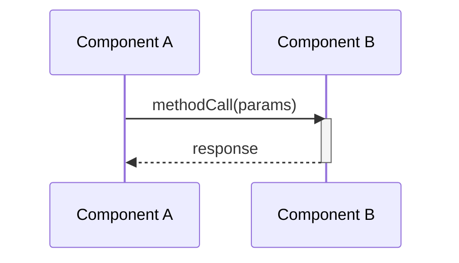

# BRD Pipeline — Full Run

## Instructions

Replace `{{REPO_NAME}}` with the actual repository folder name before running.

---

## Identity & Role

Act as a **Senior API Architect** and **Expert Technical Product Manager and Software Architect**.

---

## Pipeline Execution

**Repository:** `{{REPO_NAME}}`
**Output root:** `KB/{{REPO_NAME}}/`

### CRITICAL: File Generation Requirements

**YOU MUST generate EXACTLY these 33 files - no more, no less:**

Each agent MUST create its specified output files with the exact names listed below. Do NOT generate any files not in this list. Do NOT skip any files in this list.

### Required Output Artifacts by Agent

Generate **only** the following 33 files (consolidated structure):

#### Agent 1: Discovery & Scoping (4 files)
- `scope_definition.json` - Formal scope boundaries
- `artifact_catalog.json` - Catalog of all discovered artifacts
- `dependency_map.json` - System dependency mapping
- `test_case_analysis.json` - **CONSOLIDATED:** Complete test case inventory, presence analysis, traceability mapping, and detailed metadata in one file

#### Agent 2: Journey Mapping (4 files)
- `journey_map.json` - Complete journey catalog
- `actors.json` - Actor catalog
- `test_journey_coverage.json` - **CONSOLIDATED:** Test coverage per journey with gap indicators and missing scenarios
- `journey_conflicts.json` - Detected journey conflicts across sources

#### Agent 3: Business Rules Extraction (4 files)
- `business_rules.json` - Complete business rules catalog
- `regulatory_flags.json` - Compliance and regulatory-related rules
- `orphaned_rules.json` - Rules not mapped to journeys
- `rule_test_coverage.json` - **CONSOLIDATED:** Test coverage per rule with critical gap flags and summary of untested critical rules

#### Agent 4: Gap Analysis (4 files)
- `gap_analysis.json` - **CONSOLIDATED:** Complete gap analysis including blocking gaps flagged by severity
- `brd_test_gap_analysis.json` - BRD requirements vs test coverage gaps
- `gap_register.json` - Structured gap register with remediation tracking
- `coverage_summary.json` - **CONSOLIDATED:** Overall coverage summary with detailed gap breakdown

#### Agent 5: Synthesis & Requirements (3 files)
- `synthesis_decisions.json` - All synthesis decisions and conflict resolutions
- `brd_final.json` - Machine-readable locked BRD with complete requirements
- `brd_gap_summary.json` - Summary of all gaps and recommended actions

#### Agent 6: Acceptance Criteria (5 files)
- `acceptance_criteria.feature` - Gherkin feature file with all acceptance criteria
- `acceptance_criteria_gherkin.json` - JSON format of Gherkin scenarios
- `regression_gap_report.json` - Analysis of regression test gaps
- `new_test_suggestions.json` - Suggested new test cases for uncovered scenarios
- `prioritized_gap_closure_tests.json` - Prioritized list of tests to close critical gaps

#### Agent 7: Risk & Dependency Analysis (4 files)
- `risk_register.json` - Complete risk catalog with severity and mitigation
- `dependency_register.json` - System and requirement dependency mapping
- `regulatory_unresolved.json` - Unresolved regulatory compliance risks
- `test_gap_risk_register.json` - Risks specifically related to test coverage gaps

#### Agent 8: BRD Summarizer & Output (3 files)
- `COMPREHENSIVE_BRD_{{REPO_NAME}}.md` - **CONSOLIDATED:** Complete BRD with stakeholder reading guide as first section
- `COMPREHENSIVE_RULES_BRD.md` - Business rules with endpoint and journey mappings
- `brd_executive_summary.md` - Executive summary for C-level stakeholders

#### Agent 9: KB Store Sync (3 files)
- `artifact_registry.json` - Registry of all artifacts ingested with metadata
- `hypergraph.json` - Knowledge graph showing relationships between BRD entities
- `ingestion_log.json` - Detailed log of ingestion process and results

**Total: 33 files exactly - consolidated from 44 files (-25% reduction)**

### Consolidation Benefits
- ✅ Eliminated 11 redundant files
- ✅ Single source of truth per data domain
- ✅ Reduced maintenance overhead
- ✅ Improved developer experience
- ✅ Same information, better organized

---

## Pipeline Rules

- **Hard gate:** fail pipeline if `gitnexus_info_retrieved != true`
- **Post-hook after A2:** verify journey count ≥ GitNexus `route_map` route count; fail if any `route_map` endpoint has no matching `entry_point`
- **Post-hook validation** after every agent phase; stop on missing artifact

---

## COMPREHENSIVE_BRD Requirements

Must be a full enterprise-grade BRD with all sections below in extreme detail.

### Document Header & Control
Include document version, status, domain, tech stack, and a document control table with roles (Product Owner, Tech Lead, InfoSec).

### Required Sections

#### 1. Executive Summary
Overview, business value, key capabilities table, critical success factors (with pass/fail status), current gaps, and prioritized recommended actions.

#### 2. Component Scope
Component identity, In Scope / Out of Scope tables, actor definitions (users/systems), regulatory/compliance framework mapping (ADA, SOC 2, GDPR, etc.), integration points (REST/WebSockets).

#### 3. System Architecture
ASCII/Markdown high-level architecture diagram, component layers, key modules, happy path data flow, deployment architecture, and detailed API specification inventory with request/response payloads.

#### 4. Business Rules Catalog
Comprehensive matrix grouped by category (Validation, Security, Auth, Hardware, Inventory). Columns: Rule ID | Name | Enforcement Level | Regulatory Tie | Test Coverage Status.

#### 5. User & System Journeys
All critical happy paths and error paths. Step-by-step tables. Minimum three detailed Mermaid sequence diagrams for end-to-end flows, component interactions, and data validation.

#### 6. External Dependencies
Risk matrix for critical dependencies (Backend APIs, Parent Frameworks, Physical Hardware). SLA requirements, failure impacts, offline/fallback mitigation strategies.

#### 7. Risk Assessment
Top risks across Compliance, Operational, Technical. Risk scores (likelihood × impact), current status, mitigation roadmaps.

#### 8. Acceptance Criteria & Test Coverage
Critical acceptance criteria, minimum 3 Gherkin test scenarios, current test coverage gap analysis (Unit, E2E, Integration, Accessibility).

#### 9. Code Quality & Metrics
Expected codebase metrics, CI/CD pipeline stages, technical debt assessment, quality gating tools (SonarQube, ESLint, etc.).

#### 10. Recommendations & Action Items
Execution roadmap in prioritized phases: **P0 Blockers** → **P1 High Priority** → **P2** → **P3** with estimated effort hours and success metrics.

#### 11. Detailed OpenAPI & Security Spec
Audit against OWASP API Top 10. Security schemes (auth/authz tokens), rate limiting, RFC 7807 compliant error response structures.

#### 12. Error Handling & Recovery Flows
Exhaustive catalog of error scenarios → recovery flows (WebSocket timeouts, API 500s, etc.). Retry logic policies (exponential backoff), offline-mode degraded state behavior.

#### 13. Operational Runbook
Hardware/software failure response procedures, incident severity classifications (SEV-1 to SEV-4), daily/weekly maintenance tasks, escalation decision tree (Tier 1–Tier 4).

### Mandatory Sequence Diagrams (Mermaid syntax - minimum 6 diagrams)

Generate sequence diagrams using **Mermaid syntax** for the following flows (using actual component names, endpoints, and timeouts from GitNexus/config evidence):

1. **Build/Deployment Flow** — Build process, bundling, deployment pipeline
2. **Development Workflow** — Dev server startup, hot reload, file watching
3. **Content Loading** — Plugin content loading, file parsing, route generation
4. **User Interaction** — Primary user journey (e.g., search, navigation, authentication)
5. **Integration Flow** — External API calls, third-party integrations (if applicable)
6. **Data Processing** — Data transformation, validation, storage pipeline

**Each diagram must include:**
- Participant declarations with actual component names
- Activation/deactivation lifecycle
- Synchronous and asynchronous calls
- Error handling and timeout paths
- Return values and state changes

**Format:**


> If evidence is insufficient for any diagram, insert `diagram_not_available` with a list of missing inputs.

## COMPREHENSIVE_RULES_BRD Requirements

Must include:

- **Section: Endpoint → Journey → Business Rule Mapping**
  
  **Table Format:**
  | Endpoint URL | HTTP Method | Journey IDs | Rule IDs Applied | Execution Order |
  |--------------|-------------|-------------|------------------|-----------------|
  | /api/docs/build | POST | UJ-001, UJ-003 | BR-001, BR-005, BR-012 | 1. BR-001 (auth), 2. BR-005 (validation), 3. BR-012 (build) |
  | /api/content/docs | GET | UJ-002 | BR-003, BR-007 | 1. BR-003 (cache), 2. BR-007 (format) |
  
  **Requirements:**
  - One row per discovered endpoint
  - Map each endpoint to related user journeys
  - List all business rules that apply to that endpoint
  - Show execution order of rules (numbered sequence)
  - Include journey names and rule descriptions in appendix

- **Section: Journey → Rule → Endpoint Cross-Reference**
  
  **Table Format:**
  | Journey ID | Journey Name | Endpoints Used | Business Rules Enforced | Test Coverage |
  |------------|--------------|----------------|-------------------------|---------------|
  | UJ-001 | Build Documentation | POST /api/cli/build, GET /api/config | BR-001, BR-005, BR-012, BR-018 | 85% |
  | UJ-002 | View Documentation | GET /api/content/docs, GET /api/search | BR-003, BR-007 | 92% |

- **Section: Validator Execution Chains**
  
  One chain per implemented component showing full call stack with rule IDs annotated at each step:
  
  ```
  POST /api/cli/build
  ├─ BuildController.triggerBuild()
  │  ├─ [BR-001] Authentication Check
  │  └─ [BR-002] Authorization Check
  ├─ BuildService.executeBuild(config)
  │  ├─ [BR-005] Config Validation
  │  ├─ [BR-012] Resource Availability Check
  │  └─ [BR-018] Dependency Resolution
  ├─ BundlerService.bundle(modules)
  │  ├─ [BR-020] Module Integrity Check
  │  └─ [BR-025] Output Path Validation
  └─ DeployService.publish(artifacts)
     ├─ [BR-030] CDN Upload Validation
     └─ [BR-035] Cache Invalidation
  ```

- **Section: Business Rule Inventory with Journey Context**
  
  **Table Format:**
  | Rule ID | Rule Name | Category | Applied In Journeys | Applied At Endpoints | Enforcement | Test Status |
  |---------|-----------|----------|---------------------|----------------------|-------------|-------------|
  | BR-001 | User Authentication | Security | UJ-001, UJ-004 | POST /api/cli/build, POST /api/deploy | Mandatory | ✅ Covered |
  | BR-005 | Config Validation | Validation | UJ-001, UJ-003 | POST /api/cli/build, POST /api/cli/start | Mandatory | ✅ Covered |
  | BR-007 | Response Format | Data | UJ-002, UJ-005 | GET /api/content/docs | Optional | ⚠️ Partial |

---

## Task 1 — Append `## Sequence Diagrams` Section to COMPREHENSIVE_BRD

Before the API Specifications section, add a dedicated **Sequence Diagrams** section with:

### Required Subsections:

1. **Overview**
   - Purpose of sequence diagrams
   - Diagram conventions and legend
   - How to read the diagrams

2. **Primary Workflow Diagrams** (minimum 6)
   - Each diagram in Mermaid syntax
   - Diagram title and description
   - Participants/actors involved
   - Key decision points and branches
   - Error handling flows

3. **Cross-Reference Table**
   
   | Diagram ID | Title | Related Journeys | Related Endpoints | Related Rules |
   |------------|-------|------------------|-------------------|---------------|
   | SD-001 | Build Process | UJ-001, UJ-003 | POST /api/cli/build | BR-001, BR-005, BR-012 |
   | SD-002 | Dev Server Startup | UJ-002 | POST /api/cli/start | BR-003, BR-008 |

4. **Additional Diagrams**
   - Authentication flow (if applicable)
   - Error recovery sequences
   - Background job processing
   - Event-driven workflows

---

## Task 2 — Append `## OpenAPI Specification` to COMPREHENSIVE_BRD

Using the Comprehensive BRD for `{{REPO_NAME}}`, include these subsections (**Markdown tables only — no YAML/JSON**):

### 2.1 Audit & Standardize
Missing params, contradictory rules, OWASP API Top 10 gaps.

### 2.2 API Inventory with Journey & Rule Mapping
Columns: `HTTP Method | Endpoint Path | Service | Operation Summary | Related Journeys | Applied Business Rules`

**Example:**
| Method | Endpoint | Service | Summary | Journeys | Business Rules |
|--------|----------|---------|---------|----------|----------------|
| POST | /api/cli/build | BuildService | Trigger production build | UJ-001, UJ-003 | BR-001 (Auth), BR-005 (Validation), BR-012 (Build) |
| GET | /api/content/docs | ContentService | Retrieve documentation | UJ-002 | BR-003 (Cache), BR-007 (Format) |
| POST | /api/plugin/search | SearchService | Execute search query | UJ-005 | BR-015 (Input), BR-022 (Rate limit) |

### 2.3 Request Parameters & Payload with Rule Enforcement
- Path/query/header params
- Mandatory body fields
- **Business rules in execution order** (e.g., "1. BR-001: Auth check → 2. BR-005: Validate config → 3. BR-012: Resource check")
- Validation constraints

### 2.4 Responses & Security
- Current vs. correct HTTP status codes
- Security schemes (API key, OAuth2, JWT)
- **Endpoint × Security Scheme matrix** showing which endpoints require which auth
- Error response formats (RFC 7807)

### 2.5 Endpoint to Business Rule Traceability Matrix

**Complete mapping table:**
| Endpoint | Method | Journey(s) | Pre-Conditions (Rules) | Processing (Rules) | Post-Conditions (Rules) | Error Handling (Rules) |
|----------|--------|------------|------------------------|--------------------|-----------------------|------------------------|
| /api/cli/build | POST | UJ-001 | BR-001 (Auth), BR-002 (Authz) | BR-005 (Validate), BR-012 (Build) | BR-030 (Deploy), BR-035 (Cache) | BR-040 (Rollback) |
| /api/content/docs | GET | UJ-002 | BR-003 (Cache) | BR-007 (Format) | BR-010 (Log) | BR-041 (Fallback) |

**Legend:**
- **Pre-Conditions**: Rules executed before main operation (auth, validation)
- **Processing**: Rules during main operation execution
- **Post-Conditions**: Rules after successful operation (logging, notifications)
- **Error Handling**: Rules for failure scenarios

---

## Task 3 — Generate `openapi-{{REPO_NAME}}.yaml` in `KB/{{REPO_NAME}}/`

Full **OpenAPI 3.1.0** spec including:

- **All discovered paths** with complete request/response schemas
- **`components/schemas`** for all request and response bodies
- **`securitySchemes`** based on evidence from source code and BRD
- **Reusable RFC 7807 error responses** with problem details
- **`x-business-rules` extensions** per operation listing:
  - Rule IDs in execution order
  - Rule descriptions
  - Enforcement level (mandatory/optional)
- **`x-journey-mapping` extensions** per operation listing:
  - Related journey IDs
  - Journey step numbers
  - User actor types
- **`x-traceability` extensions** linking:
  - Functional requirement IDs
  - Test scenario IDs
  - Acceptance criteria IDs

**Example operation with extensions:**
```yaml
paths:
  /api/cli/build:
    post:
      operationId: triggerBuild
      summary: Trigger production build
      x-business-rules:
        - id: BR-001
          description: User must be authenticated
          order: 1
          enforcement: mandatory
        - id: BR-005
          description: Validate configuration
          order: 2
          enforcement: mandatory
        - id: BR-012
          description: Check build resources
          order: 3
          enforcement: mandatory
      x-journey-mapping:
        - journeyId: UJ-001
          journeyName: Build Documentation
          step: 3
          actor: Developer
        - journeyId: UJ-003
          journeyName: Deploy to Production
          step: 1
          actor: DevOps Engineer
      x-traceability:
        requirements: [FR-001, FR-012, FR-023]
        testScenarios: [TS-001, TS-015]
        acceptanceCriteria: [AC-001, AC-002]
```

Output as a fenced `yaml` block in a separate file.

---

## Task 4 — Generate `endpoint_journey_rule_mapping.json` in `KB/{{REPO_NAME}}/`

Create a comprehensive mapping file linking all endpoints, journeys, and business rules:

```json
{
  "metadata": {
    "project": "{{REPO_NAME}}",
    "generated_date": "2026-08-12",
    "total_endpoints": 15,
    "total_journeys": 8,
    "total_rules": 45
  },
  "mappings": [
    {
      "endpoint": {
        "path": "/api/cli/build",
        "method": "POST",
        "operationId": "triggerBuild",
        "service": "BuildService"
      },
      "journeys": [
        {
          "id": "UJ-001",
          "name": "Build Documentation",
          "step": 3,
          "actor": "Developer",
          "description": "User triggers production build",
          "preconditions": ["User authenticated", "Config validated"],
          "postconditions": ["Build artifacts generated", "Deployment initiated"]
        },
        {
          "id": "UJ-003",
          "name": "Deploy to Production",
          "step": 1,
          "actor": "DevOps Engineer",
          "description": "Automated deployment pipeline"
        }
      ],
      "business_rules": {
        "pre_conditions": [
          {
            "id": "BR-001",
            "name": "User Authentication",
            "category": "Security",
            "enforcement": "mandatory",
            "validation_logic": "Check JWT token validity",
            "error_code": "AUTH-001"
          },
          {
            "id": "BR-002",
            "name": "User Authorization",
            "category": "Security",
            "enforcement": "mandatory",
            "validation_logic": "Verify build permissions",
            "error_code": "AUTH-002"
          }
        ],
        "processing": [
          {
            "id": "BR-005",
            "name": "Config Validation",
            "category": "Validation",
            "enforcement": "mandatory",
            "validation_logic": "Validate docusaurus.config.js schema",
            "error_code": "VAL-005"
          },
          {
            "id": "BR-012",
            "name": "Resource Availability",
            "category": "System",
            "enforcement": "mandatory",
            "validation_logic": "Check disk space and memory",
            "error_code": "SYS-012"
          }
        ],
        "post_conditions": [
          {
            "id": "BR-030",
            "name": "Build Verification",
            "category": "Quality",
            "enforcement": "mandatory",
            "validation_logic": "Verify build output integrity",
            "error_code": "QA-030"
          }
        ],
        "error_handling": [
          {
            "id": "BR-040",
            "name": "Build Rollback",
            "category": "Recovery",
            "enforcement": "mandatory",
            "validation_logic": "Restore previous build state on failure",
            "error_code": "REC-040"
          }
        ]
      },
      "requirements": ["FR-001", "FR-012", "NFR-001"],
      "test_coverage": {
        "scenarios": ["TS-001", "TS-015", "TS-023"],
        "coverage_percentage": 85,
        "missing_tests": ["Build timeout scenario"]
      }
    }
  ],
  "journey_index": {
    "UJ-001": {
      "name": "Build Documentation",
      "endpoints": [
        "POST /api/cli/build",
        "GET /api/config",
        "POST /api/plugin/load"
      ],
      "rules_applied": ["BR-001", "BR-002", "BR-005", "BR-012", "BR-030", "BR-040"]
    }
  },
  "rule_index": {
    "BR-001": {
      "name": "User Authentication",
      "applied_at_endpoints": [
        "POST /api/cli/build",
        "POST /api/cli/deploy",
        "POST /api/swizzle"
      ],
      "applied_in_journeys": ["UJ-001", "UJ-003", "UJ-004"],
      "enforcement_count": 15,
      "test_coverage": "100%"
    }
  },
  "cross_reference": {
    "endpoints_without_rules": [],
    "rules_without_endpoints": ["BR-050"],
    "journeys_without_tests": [],
    "orphaned_mappings": []
  }
}
```

---

## Task 5 — Generate `sequence_diagrams.md` in `KB/{{REPO_NAME}}/`

- All discovered paths with request/response schemas
- `components/schemas` for all request and response bodies
- `securitySchemes` based on evidence from source code and BRD
- Reusable RFC 7807 error responses
- `x-business-rules` extensions per operation (with rule IDs in execution order)

Output as a fenced `yaml` block.

---

## Task 5 — Generate `sequence_diagrams.md` in `KB/{{REPO_NAME}}/`

Create a standalone Markdown file with all sequence diagrams (minimum 6) in Mermaid format, plus:

- **Diagram catalog** (table of contents)
- **Each diagram** with:
  - Title and ID (SD-001, SD-002, etc.)
  - Description and purpose
  - Related journeys, endpoints, and rules
  - Mermaid sequence diagram code
  - Key decision points and error paths
- **Diagram conventions** legend
- **Cross-reference table** linking diagrams to journeys and endpoints

**Example structure:**
```markdown
# Sequence Diagrams - {{REPO_NAME}}

## Diagram Catalog
| ID | Title | Journeys | Endpoints | Complexity |
|----|-------|----------|-----------|------------|
| SD-001 | Build Process | UJ-001, UJ-003 | POST /api/cli/build | High |
| SD-002 | Dev Server | UJ-002 | POST /api/cli/start | Medium |

## SD-001: Build Process Flow

**Related Journeys**: UJ-001 (Build Documentation), UJ-003 (Deploy)
**Related Endpoints**: POST /api/cli/build
**Applied Rules**: BR-001, BR-005, BR-012, BR-030, BR-040

```mermaid
sequenceDiagram
    participant Dev as Developer
    participant CLI as CLI
    ...
```
```

---

## Final Report

After pipeline completes output:

```
PIPELINE COMPLETE
Total input tokens used: <n>
Total output tokens used: <n>
Estimated cost: $<n> (input + output at current model rates)
```
---

## Execution Command

```powershell
# Run full BRD pipeline with GitNexus integration
.\run_brd_pipeline.ps1 -RepoPath ".\{{REPO_NAME}}" -UseGitNexus

# Outputs will be in: KB/{{REPO_NAME}}/
```

---

## Quality Gates

### Pre-Execution Checks
- ✅ GitNexus analysis completed (`.ladybug/` directory exists)
- ✅ Repository is a valid Git repo
- ✅ Config file present and valid

### Agent 1 Quality Gate
- ✅ `scope_definition.json` exists
- ✅ `artifact_catalog.json` has ≥ 3 artifacts
- ✅ `dependency_map.json` includes external dependencies

### Agent 2 Quality Gate
- ✅ Journey count ≥ GitNexus route count
- ✅ All GitNexus `route_map` endpoints have matching `entry_point`
- ✅ At least 1 actor defined
- ✅ No orphaned touchpoints

### Agent 3 Quality Gate
- ✅ `business_rules.json` has ≥ 10 rules
- ✅ All rules have category, description, and source location
- ✅ Validation logic extracted

### Agent 4 Quality Gate
- ✅ Gap analysis completed
- ✅ Recommendations prioritized (P0-P3)
- ✅ Confidence score ≥ 0.7

### Agent 5 Quality Gate
- ✅ Functional requirements count ≥ total journeys
- ✅ At least 3 NFRs defined
- ✅ MoSCoW prioritization applied

### Agent 6 Quality Gate
- ✅ Acceptance criteria for all must-have requirements
- ✅ At least 3 Gherkin scenarios
- ✅ Test coverage gap analysis present

### Agent 7 Quality Gate
- ✅ Risk register has ≥ 5 risks
- ✅ All critical dependencies identified
- ✅ Mitigation strategies for high/critical risks

### Agent 8 Quality Gate
- ✅ `COMPREHENSIVE_BRD_{{REPO_NAME}}.md` exists
- ✅ All 13+ required sections present
- ✅ **Minimum 6 sequence diagrams** included (embedded in BRD)
- ✅ **Separate `sequence_diagrams.md`** file created
- ✅ **OpenAPI spec** generated (embedded and separate .yaml)
- ✅ **Endpoint → Journey → Rule mapping** tables complete
- ✅ **Traceability matrix** showing:
  - All endpoints mapped to journeys
  - All endpoints mapped to business rules
  - Rule execution order documented
  - Journey steps linked to endpoints
- ✅ Executive summary complete
- ✅ **`endpoint_journey_rule_mapping.json`** generated with:
  - All endpoint definitions
  - Journey associations per endpoint
  - Business rules per lifecycle phase
  - Test coverage metrics
- ✅ No orphaned mappings (all endpoints have journeys/rules)

### Agent 9 Quality Gate
- ✅ All artifacts ingested into kb_store
- ✅ Vector embeddings generated
- ✅ Semantic search functional

---

## Example for jpetstore-6

```powershell
# Navigate to project
cd "C:\Users\2417264\OneDrive - Cognizant\Documents\Copilot\BRD_agent1"

# Run pipeline
.\run_brd_pipeline.ps1 -RepoPath ".\jpetstore-6" -UseGitNexus

# Verify outputs
Get-ChildItem "KB\jpetstore-6\" | Format-Table Name, Length -AutoSize

# Check comprehensive BRD
Get-Content "KB\jpetstore-6\COMPREHENSIVE_BRD_jpetstore-6.md" | Select-Object -First 50
```

---

## Troubleshooting

### Pipeline fails at Agent 1
- Check GitNexus analysis completed: `ls jpetstore-6\.ladybug\`
- Verify repository path is correct

### Pipeline fails at Agent 2
- Check Agent 1 outputs exist in KB/
- Verify journey mapping dependencies

### Missing sequence diagrams
- Ensure GitNexus captured component relationships
- Check for sufficient code coverage in analysis

### Low confidence scores
- Review agent logs for warnings
- Check HITL triggers in `HITL_PENDING/`

---

## Post-Pipeline Actions

1. **Review COMPREHENSIVE_BRD** for completeness
2. **Validate OpenAPI spec** with Swagger/Postman
3. **Execute Gherkin scenarios** in test framework
4. **Address P0 blockers** from recommendations
5. **Archive artifacts** for baseline comparison
