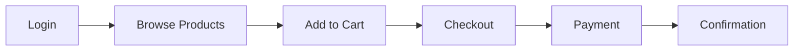
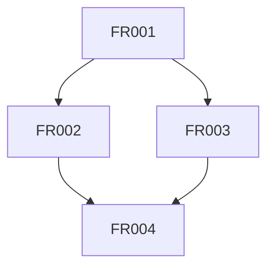
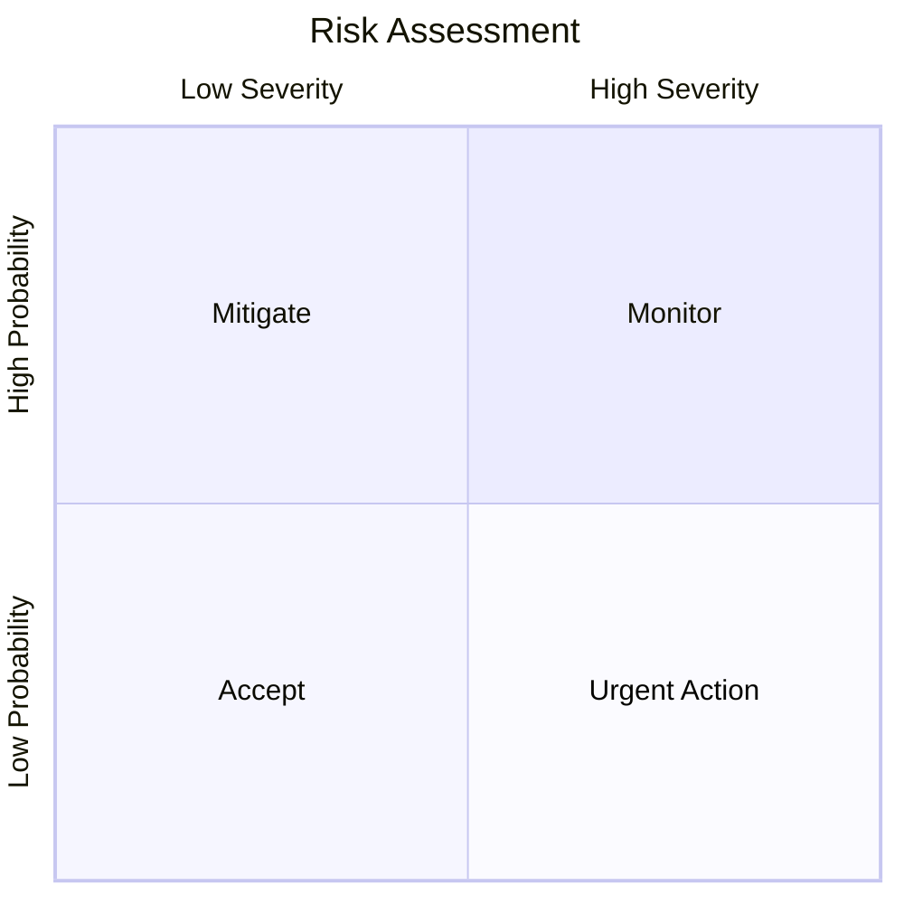

# Agent 8 BRD Summarizer & Output Skill

## Skill Definition
**Name**: Agent 8 BRD Summarizer & Output  
**Type**: Document Generation  
**Language**: PowerShell + Python  
**Agents**: Agent 8  

## Description
Consolidates all upstream agent outputs into a comprehensive, well-formatted Business Requirements Document (BRD) with executive summary, diagrams, and structured sections.

## Prerequisites
- Python 3.10+ with document generation libraries (Markdown, Jinja2)
- Outputs from Agents 1-7 in KB/{repo_name}/
- Valid `config.yaml` configuration

## Invocation

### PowerShell
```powershell
.\agent_8_summarizer.ps1 -RepoPath "C:\path\to\repo"
```

## Parameters

| Parameter | Type | Required | Default | Description |
|-----------|------|----------|---------|-------------|
| RepoPath | string | Yes | - | Path to repository |
| ConfigPath | string | No | config/config.yaml | Config file path |
| OutputPath | string | No | KB/{repo_name}/ | Output directory |
| Verbose | switch | No | false | Enable verbose logging |

## Dependencies
- **Agent 1**: Scope, artifacts, dependencies
- **Agent 2**: User journeys
- **Agent 3**: Business rules
- **Agent 4**: Gap analysis
- **Agent 5**: Requirements
- **Agent 6**: Acceptance criteria
- **Agent 7**: Risks and dependencies

## Outputs

### Files Generated
1. **final_brd.md**: Complete BRD document
   ```markdown
   # Business Requirements Document
   ## {Project Name}
   
   ### Document Information
   - **Version**: 1.0
   - **Date**: {generation date}
   - **Repository**: {repo name}
   - **Generated By**: BRD Agentic Framework
   
   ---
   
   ## 1. Executive Summary
   {High-level overview, key findings, critical requirements}
   
   ## 2. Scope Definition
   {Component name, domain, in-scope, out-of-scope, assumptions}
   
   ## 3. User Journeys
   {Journey maps, actors, touchpoints, flows}
   
   ## 4. Business Rules
   {Validation logic, constraints, decision rules}
   
   ## 5. Functional Requirements
   {Prioritized requirements with MoSCoW, traceability}
   
   ## 6. Non-Functional Requirements
   {Performance, security, scalability, usability}
   
   ## 7. Acceptance Criteria
   {Given-When-Then statements, test scenarios}
   
   ## 8. Gap Analysis
   {Identified gaps, recommendations, remediation}
   
   ## 9. Risk Assessment
   {Risks, mitigation strategies, contingency plans}
   
   ## 10. Dependencies
   {System dependencies, requirement dependencies}
   
   ## 11. Appendices
   {Diagrams, glossary, references}
   ```

2. **executive_summary.json**: Structured summary for stakeholders
   ```json
   {
     "project_name": "Spring PetClinic Modernization",
     "analysis_date": "2026-08-12",
     "repository": "spring-petclinic",
     "key_metrics": {
       "total_requirements": 45,
       "must_have_requirements": 20,
       "critical_risks": 2,
       "high_risks": 7,
       "gaps_identified": 12,
       "business_rules_extracted": 47,
       "user_journeys_mapped": 8
     },
     "critical_findings": [
       "Payment gateway dependency creates critical risk",
       "12 validation gaps require immediate attention",
       "Legacy authentication needs modernization"
     ],
     "recommendations": [
       "Implement circuit breaker for payment service",
       "Add comprehensive input validation",
       "Migrate to OAuth 2.0 authentication"
     ],
     "next_steps": [
       "Review and approve requirements",
       "Prioritize gap remediation",
       "Develop mitigation plans for critical risks"
     ],
     "overall_confidence": 0.87,
     "hitl_reviews_pending": 3
   }
   ```

## Sub-Skills
1. **Content Aggregator**: Collects all upstream outputs
2. **Executive Summarizer**: Generates high-level summary
3. **Markdown Formatter**: Formats BRD in Markdown
4. **Diagram Generator**: Creates Mermaid diagrams
5. **Metrics Calculator**: Computes summary statistics

## Tools Used
- Jinja2 templates for document generation
- Markdown formatting
- Mermaid for diagrams (flowcharts, sequence diagrams)
- JSON parsing for all upstream artifacts

## BRD Structure

### 1. Executive Summary (1-2 pages)
- Project overview
- Key findings and metrics
- Critical risks and recommendations
- High-priority requirements
- Next steps

### 2. Scope Definition (2-3 pages)
- Component identification
- Domain and context
- In-scope functionality
- Out-of-scope items
- Assumptions and constraints

### 3. User Journeys (5-10 pages)
- Actor catalog
- Journey maps with touchpoints
- User flow diagrams
- Pain points and opportunities

### 4. Business Rules (3-7 pages)
- Validation rules
- Business constraints
- Decision logic
- Workflow rules
- Authorization policies

### 5. Functional Requirements (10-20 pages)
- Requirements by category
- MoSCoW prioritization
- Traceability to sources
- Acceptance criteria references
- Complexity assessments

### 6. Non-Functional Requirements (3-5 pages)
- Performance requirements
- Security requirements
- Scalability requirements
- Usability requirements
- Maintainability requirements

### 7. Acceptance Criteria (10-15 pages)
- Given-When-Then statements
- Test scenarios
- Edge cases
- Test data suggestions

### 8. Gap Analysis (3-5 pages)
- Identified gaps by severity
- Recommendations
- Effort estimates
- Priority ranking

### 9. Risk Assessment (5-8 pages)
- Risk register
- Risk heat map
- Mitigation strategies
- Contingency plans
- Risk ownership

### 10. Dependencies (2-4 pages)
- Requirement dependency graph
- System dependency map
- External dependencies
- Critical path analysis

### 11. Appendices
- Glossary of terms
- Acronyms
- References
- Additional diagrams

## Diagram Types

### Generated Mermaid Diagrams

#### 1. User Journey Flow


#### 2. Dependency Graph


#### 3. Risk Heat Map


## Error Handling
- Missing upstream output: Fails with clear error listing missing files
- Low confidence sections: Flagged with warnings in BRD
- HITL pending items: Listed in executive summary

## Performance
- Small repos: ~2-5 minutes
- Medium repos: ~5-10 minutes
- Large repos: ~10-15 minutes

## Examples

### Example 1: Spring PetClinic
```powershell
.\agent_8_summarizer.ps1 -RepoPath "C:\repos\spring-petclinic" -Verbose
```
**Output**: 45-page BRD with 8 user journeys, 47 business rules, 45 requirements

### Example 2: Microservices Architecture
```powershell
.\agent_8_summarizer.ps1 -RepoPath "C:\repos\order-service"
```
**Output**: 32-page BRD focused on API contracts and integration

## HITL Integration
Agent 8 includes HITL review status in BRD:
- Sections with low confidence highlighted
- Pending reviews listed in executive summary
- Flagged items marked for stakeholder approval

## Configuration
```yaml
agents:
  agent8:
    name: "BRD Summarizer & Output Agent"
    tools: []
    output_files:
      - final_brd.md
      - executive_summary.json
```

## Document Customization

### Template Variables
The BRD template supports customization via `config.yaml`:
```yaml
brd_template:
  company_name: "Cognizant"
  logo_url: "https://example.com/logo.png"
  include_sections:
    - executive_summary
    - scope
    - journeys
    - requirements
    - acceptance_criteria
    - risks
    - dependencies
  exclude_sections:
    - business_rules  # If too technical for audience
  diagram_format: "mermaid"  # or "plantuml"
```

## Post-Generation Steps

### 1. Review
- Stakeholder review of executive summary
- Technical review of requirements and acceptance criteria
- Security review of risk assessment

### 2. Approval
- Sign-off from product owner
- Approval from architecture team
- Security team approval

### 3. Distribution
- Export to PDF for distribution
- Upload to Confluence/SharePoint
- Share with development team

### 4. Baseline
- Version control the BRD
- Link to project management tools
- Create traceability matrix

## Export Formats

### Markdown to PDF
```powershell
# Using pandoc (install separately)
pandoc final_brd.md -o final_brd.pdf --toc --template=eisvogel
```

### Markdown to DOCX
```powershell
pandoc final_brd.md -o final_brd.docx --toc
```

### Markdown to HTML
```powershell
pandoc final_brd.md -o final_brd.html --standalone --toc
```

## Quality Checks

Agent 8 performs final quality validation:
- ✅ All sections present
- ✅ No broken internal links
- ✅ All diagrams render correctly
- ✅ Consistent formatting
- ✅ Traceability links valid
- ✅ No orphaned requirements
- ✅ All HITL items documented

## Troubleshooting

### Issue: BRD generation fails
**Cause**: Missing upstream agent outputs  
**Solution**: Check error message for missing files, run missing agents

### Issue: Diagrams not rendering
**Cause**: Mermaid syntax errors  
**Solution**: Validate Mermaid syntax at https://mermaid.live

### Issue: BRD too large/complex
**Cause**: Large repository with many findings  
**Solution**: Use template customization to exclude less critical sections

## Integration

### Downstream Usage
- **Project Management**: Import requirements to Jira/Azure DevOps
- **Test Management**: Import acceptance criteria to TestRail
- **Risk Management**: Import risks to risk register tools
- **Knowledge Base**: Agent 9 ingests BRD into kb_store

### Version Control
- Commit BRD to Git with tag for version tracking
- Use semantic versioning (1.0, 1.1, 2.0)
- Track changes via Git diff

## See Also
- `.github/agents/subagents/agent-8-summarizer.agent.md`
- Mermaid documentation: https://mermaid.js.org/
- Pandoc: https://pandoc.org/
- `config/config.yaml` - Agent configuration
